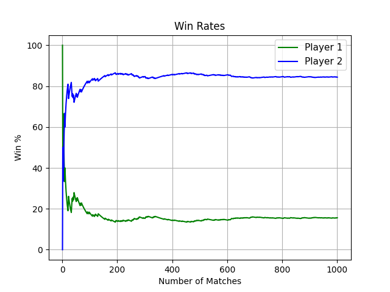

# Monte Carlo Tennis Match Simulator

Best-of-three tennis match simulator where real serve statistics determine the probability of winning a point on serve. Following the hierarchical model of tennis, knowing that probability for each player is enough to derive the probability of winning a game, a set and the match. The simulator propagates it point by point through the full scoring tree and runs the match 1,000 times, so the win rates converge to an accurate estimate. The engine also prints the match as it is played: score, service breaks, side changes and breaks between games.

## Result

Simulating 1,000 matches between **Jannik Sinner** and **Rafael Jodar** with their real serve statistics:

| Player | Points won on serve | Matches won |
|---|---|---|
| Jannik Sinner | 73.0% | ~85% |
| Rafael Jodar | 64.4% | ~15% |




A simple 9% win difference delivers a ~70 percent point difference per match. Luck gets filtered out through hundreds of points and the advantage has to be repeated four points a game, six games a set and two sets a match.

The graph shows how randomness prevails at the start of the simulation, but as the number of matches increases, win rates converge.

## How it works

**1. Serve-win probability from real stats.** Each player's probability of winning a point on serve is a weighted average of the two serves:

```
P(win point on serve) = first_serve_in × first_serve_won + (1 − first_serve_in) × second_serve_won
```

| Player | 1st serve in | 1st serve points won | 2nd serve points won | **P(win point on serve)** |
|---|---|---|---|---|
| Jannik Sinner | 65.0% | 80.5% | 59.2% | **73.0%** |
| Rafael Jodar | 64.1% | 69.9% | 54.6% | **64.4%** |

**2. Point by point.** On every point, the server's own serve-win probability decides the outcome: if Sinner serves, he wins the point 73.0% of the time; if Jodar serves, he wins it 64.4% of the time.

**3. Scoring engine.** Points are propagated through the full ATP scoring tree: 15/30/40, deuce and advantage, games, service rotation, side changes, a tiebreak at 6–6 (first to 7, win by two, server changing every two points) and a best-of-three match.

**4. Monte Carlo.** The match is simulated 1,000 times from scratch, and the share of matches won by each player is the estimated win probability.

## Assumptions and limitations

- **The returner is ignored.** A point depends only on how well the server serves, not on how well the opponent returns. A two-parameter model (serve strength and return strength) would be more realistic.
- **Points are independent.** Every point has the same probability, regardless of the score. There is no momentum, fatigue or pressure effect. Whether momentum exists in tennis at all is still debated, so testing it empirically would be a project in itself rather than a parameter to invent.
- **Serve statistics are averages.** They come from matches against a range of opponents, on different surfaces and in different conditions, so they do not reflect this specific matchup.
- **Best of three sets**, so the result does not apply to Grand Slam matches.
- **No surface adjustment.** Serve effectiveness varies a lot between clay, hard court and grass.

## Next steps

- Model each point with both the server's serve statistics and the returner's return statistics.
- Use surface-specific statistics.
- Test empirically whether momentum exists, instead of assuming it away.

## Setup

```
pip install matplotlib
python tennis_match_simulator.py
```

## Data

Data is imported from Sofascore 2026 all surface statistics for Jannik Sinner and Rafael Jodar.
